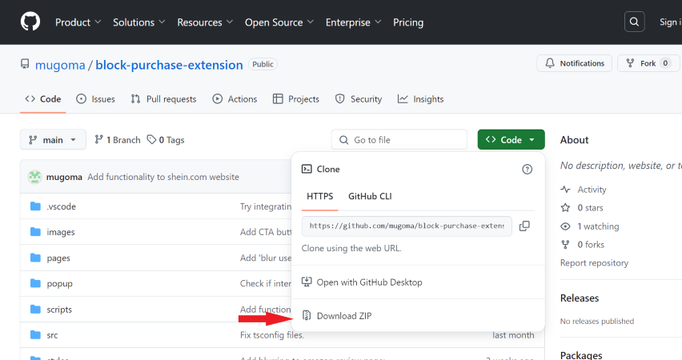

# Block Purchase Extension

Welcome the the official repository of the Block-Purchase Extension. 

## Table of Contents  
[How to Install](#how-to-install)  
[What does this extension do?](#what-does-this-extension-do)

## How to Install

1. Download a copy of this extension by clicking the Download button above.    

2. Unzip the package.   

3. Open the [extensions](chrome://extensions) page in Google Chrome/ Microsoft Edge Browser. Link: [chrome://extensions]().  

4. Toggle 'Developer mode' ON.   

5. Click 'Load unpacked'.  

6. Select the unzipped folder.   

7. You are done!   

## What does this extension do?

This extension is meant to reduce impulsive online shopping. It does so 
by reducing the influence of the [dark patterns]() retailers use on their
websites.  